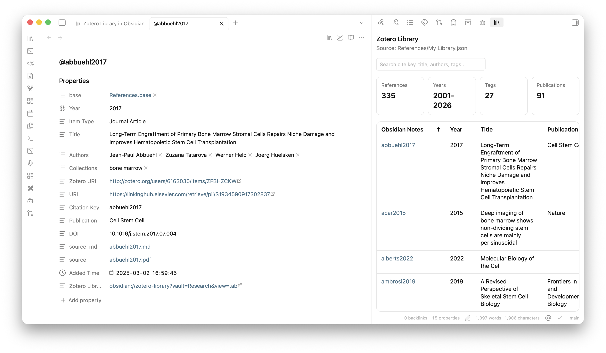
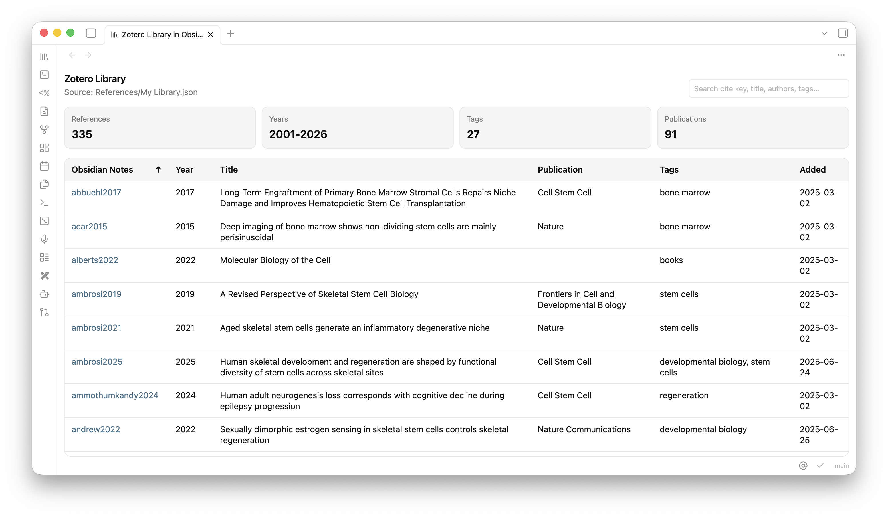
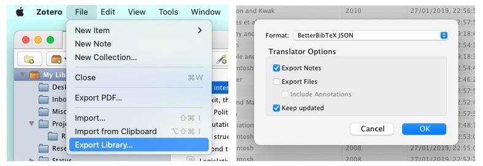
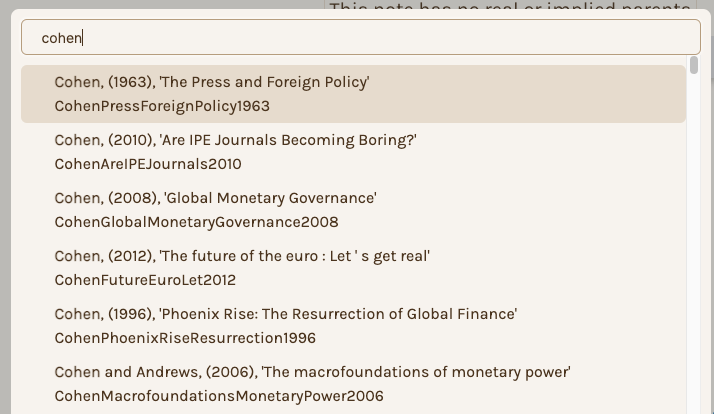
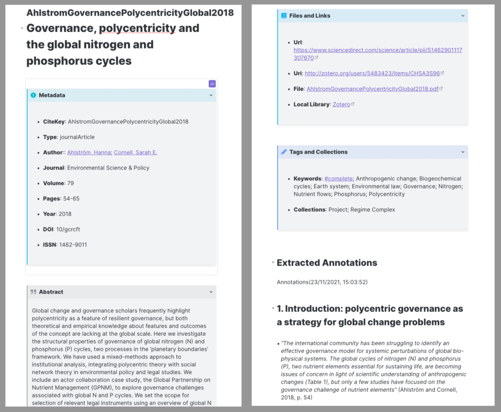
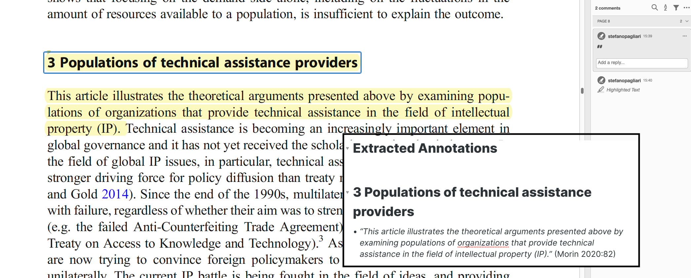
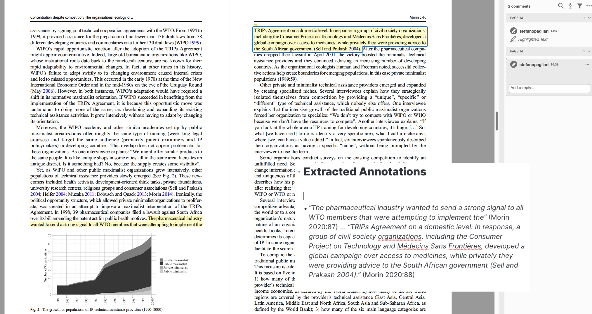
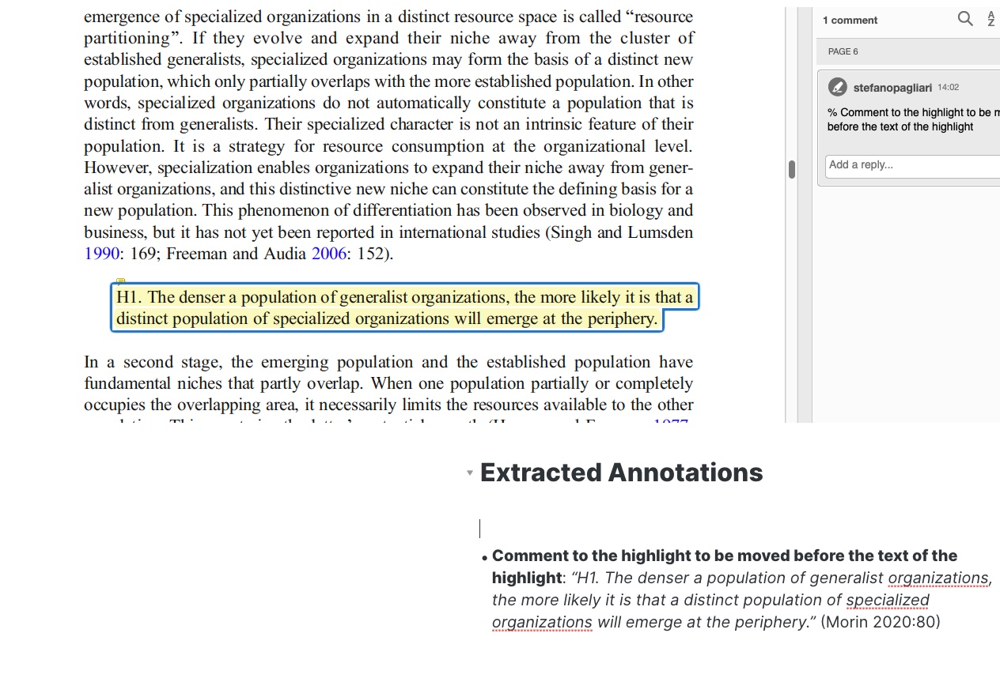
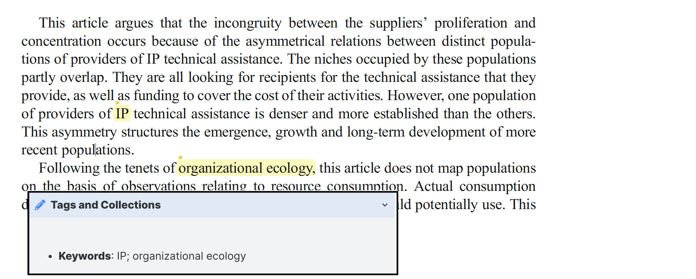
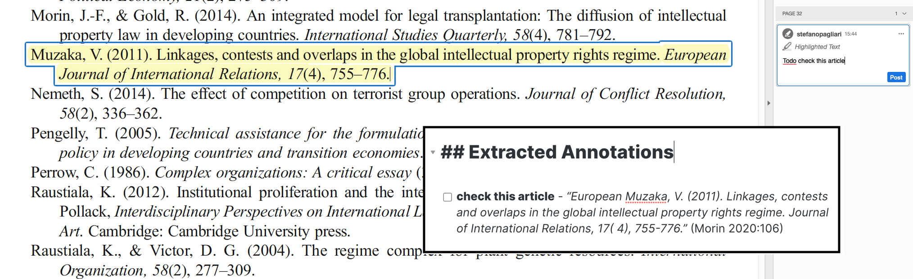

> Note: This plugin is vibe coded.

# Zotero Lib View

This project is a major enhancement of the original [bibnotes](https://github.com/stefanopagliari/bibnotes) project by Stefano Pagliari, and is maintained at [Lebenswille/zotero-library-in-obsidian](https://github.com/Lebenswille/zotero-library-in-obsidian).

Zotero Lib View is a comprehensive tool for importing, updating, and browsing your Zotero library directly inside Obsidian. It retains the powerful note-generation and annotation-formatting workflow of the original project while adding a structured, in-app Library View designed for managing reference-to-note connections seamlessly.

## What This Fork Adds

This version introduces a **library-first workflow** and several quality-of-life improvements:

- **Integrated Library View**: A dedicated table view that reads your Better BibTeX JSON directly. No more switching apps just to find a reference.
- **Note-Aware Entries**: Clicking a citation key in the library view instantly opens its literature note. If the note doesn't exist, it is created from your template and opened automatically.
- **Sidebar or Tab**: Open the library view as a normal tab or pin it to the right sidebar.
- **Custom Obsidian URI Support**: Use links like `obsidian://zotero-library?vault=YourVault&view=tab` to jump straight into your library.
- **Automatic Sync**: Watches for changes in your exported `My Library.json` and refreshes the view.
- **Configurable Columns**: Customize which metadata fields are visible (Notes, Year, Type, Title, Authors, Publication, Tags, Collections, Parent Collections, Added, etc.) and their order.
- **Note-Page Integration**: Adds a header button to your literature notes to quickly jump back to the library entry.

## Recommended Workflow

1. **Export**: Export your Zotero library (or specific collection) as **Better BibTeX JSON**.
2. **Auto-Update**: (Optional) In Zotero, select "Keep updated" so the JSON file reflects your latest library changes.
3. **Configure**: Save the JSON inside your vault and point the plugin settings to its location and your desired storage folder for literature notes.
4. **Browse & Create**: Use the **Library View** to explore your references. Click any cite key to generate or open the corresponding literature note.
5. **Read & Annotate**: Enjoy a seamless transition from browsing your library to editing your research notes.



## Installation

### Rename Notice
This plugin has been renamed to **Zotero Lib View** to comply with Obsidian community plugin naming guidelines. Because the plugin ID changed, existing users need to reinstall the plugin in the new `.obsidian/plugins/zotero-lib-view/` folder.

To switch without losing settings, copy your existing `data.json` from the old plugin folder into the new plugin folder before enabling **Zotero Lib View**.

### Manual Installation
1. Download the latest release from GitHub.
2. Unzip or clone the release into your vault's `.obsidian/plugins/zotero-lib-view/` directory.
3. Enable "Zotero Lib View" in the Community plugins settings.

### Via BRAT
If you have the [BRAT plugin](https://github.com/TfTHacker/obsidian42-brat/) installed:
1. Use `Lebenswille/zotero-library-in-obsidian` to add it as a Beta plugin.
2. Enable it in the Community plugins tab.

---

## Library View

The Library View is the core enhancement of this fork. It allows you to interact with your bibliography as a structured database within your workspace.

- **Configurable Columns**: Choose from `Obsidian Notes`, `Year`, `Type`, `Title`, `Authors`, `Publication`, `Tags`, `Collections`, `Parent Collections`, `Added`, or any custom field provided by Better BibTeX.
- **Live Search**: The search bar searches across the *full* library record, including abstract and tags, even if they aren't visible as columns.
- **Sorting**: Click any sortable header to reorder your library.
- **Note-Aware**: Clicking the cite key opens the note; clicking `Actions` buttons lets you jump to Zotero, Web, or the PDF.



---

## Importing your Zotero Library into Obsidian

To import your references and notes from Zotero, export your library as a Better BibTeX JSON file and save it inside your vault. Then follow these steps:

- install within Zotero the plugin ["Better BibTex for Zotero"](https://retorque.re/zotero-better-bibtex/installation/).
- in the main menu of Zotero go to `File > Export Library` (or right-click a collection/folder and select `Export Collection/Items`).
- select the export format "**BetterBibTex Json**".
- select **"Export Notes"** if you would like to import annotations into Obsidian.
- *(Optional)* select **"Keep updated"** to automatically update the exported library once an entry is changed.
- save the BetterBibTex JSON file in a folder **within** your Obsidian Vault.
- in the plugin settings within Obsidian, add the **relative path** to the JSON file and the folder where you would like literature notes to be stored.



---

## Commands

The plugin introduces several commands to streamline your research:

- **Create/Update Literature Note**: Prompts you to choose a reference from your library. If it hasn't been imported yet, a new note is generated. If it exists, its content is updated based on your "Save Manual Edits" settings. You can also select "Entire Library" to batch process everything.
- **Update Library**: Automatically generates/updates all notes that have been modified in Zotero since the last sync.
- **Open Zotero Lib View (Tab/Sidebar)**: Opens the structured library interface.
- **Update Current Literature Note**: Refresh the metadata and annotations for the note currently active in your editor.



---

## Create Literature Notes

By default, the plugin exports both metadata and Zotero annotations.

### Templates
You can select between default templates (**Plain**, **Admonition**) or provide a **Custom Template**.

### Placeholders
You can use placeholders in your templates to insert metadata from Better BibTeX and Zotero. In general, any field present in the exported Better BibTeX JSON can be used directly in the template with the form `{{fieldName}}`.

Common metadata placeholders include:

- `{{citeKey}}` / `{{citekey}}`: the Better BibTeX citation key.
- `{{title}}`: the item title.
- `{{itemType}}`: the Zotero item type.
- `{{author}}` / `{{authors}}`: formatted author surname key.
- `{{authorInitials}}` / `{{authorsInitials}}`: formatted author key using initials.
- `{{authorFullName}}` / `{{authorsFullName}}`: formatted author key using full names.
- `{{editor}}`: editor names.
- `{{translator}}`: translator names.
- `{{publisher}}`: publisher.
- `{{place}}`: place of publication.
- `{{series}}`: series title.
- `{{seriesNumber}}`: series number.
- `{{publicationTitle}}`: journal, conference, or publication title.
- `{{volume}}`: volume number.
- `{{issue}}`: issue number.
- `{{pages}}`: page range.
- `{{year}}` / `{{date}}`: publication year.
- `{{DOI}}`, `{{ISBN}}`, `{{ISSN}}`: identifier fields.
- `{{abstractNote}}`: abstract text.
- `{{url}}`, `{{uri}}`, `{{eprint}}`: URL-style metadata fields.

Placeholders for links and files:

- `{{localLibraryLink}}`: link target for the Zotero library entry.
- `{{localLibrary}}`: Zotero library URI for the item.
- `{{zoteroReaderLink}}`: link to open the specific attachment in the Zotero reader.
- `{{file}}`: file information exported by Better BibTeX.
- `{{localFile}}`: local file links for attachments.
- `{{localFilePathLink}}`: local file path links for attachments.

Placeholders for people and citations:

- `{{creator}}`: all creators combined according to the configured name format.
- `{{citationInLine}}`: inline citation string based on authors and year.
- `{{citationInLineInitials}}`: inline citation string using author initials.
- `{{citationInLineFullName}}`: inline citation string using full author names.
- `{{citationShort}}`: shortened citation form.
- `{{citationFull}}`: fuller citation form.

Placeholders for tags and collections:

- `{{keywordsZotero}}`: tags coming from Zotero metadata.
- `{{keywordsPDF}}`: tags extracted from the PDF annotation workflow.
- `{{keywords}}` / `{{keywordsAll}}`: combined keyword list.
- `{{collections}}`: collections/folders where the entry is located.
- `{{collectionsParent}}`: collections/folders where the entry is located, plus their parent folders.

Placeholders for notes and annotations:

- `{{UserNotes}}`: Zotero notes attached to the item.
- `{{PDFNotes}}`: all highlights, comments, tags, and images extracted from the PDF.
- `{{Images}}`: all images extracted via the Zotero PDF Reader.
- `{{Yellow}}`, `{{Red}}`, `{{Green}}`, `{{Blue}}`, `{{Purple}}`, `{{Black}}`, `{{White}}`, `{{Gray}}`, `{{Orange}}`, `{{Cyan}}`, `{{Magenta}}`, `{{CustomHex}}`: annotations filtered by highlight color.

For repeated values such as creators, keywords, and collections, you can also wrap placeholders in formatting markers:

- `[[{{keywords}}]]` or `[[{{collections}}]]`: export as wikilinks.
- `"{{keywords}}"`: export as quoted values.
- `#{{keywords}}`: export as tags.

This fork also adds YAML-friendly wikilink list placeholders for Obsidian Properties/frontmatter:

- `{{keywordsYamlWikiList}}`: exports keywords as:
  ```yaml
  - "[[Keyword A]]"
  - "[[Keyword B]]"
  ```
- `{{collectionsYamlWikiList}}`: exports collections as:
  ```yaml
  - "[[Collection A]]"
  - "[[Collection B]]"
  ```

### Note Title
Specify the format of the note title (e.g., `{{citeKey}}`, `{{title}}`, `{{author}}`).



---

## Formatting Annotations

In the plugin settings, you can select the formatting of the extracted highlights and comments:

- **Double Space**, **Italic**, **Bold**, **Quotation Marks**, **Highlight**, **Bullet Points**, **Blockquote**.
- **Custom text** before or after all highlights/comments.

---

## Advanced Highlight Formatting

You can perform additional transformations by adding a "keyword" at the beginning of a Zotero comment:

- **Heading**: Turn highlighted text into a heading (Level 1 to 6).
  

- **MergeAbove**: Append highlight to the previous one (to merge paragraphs across pages).
  

- **Preprend Comment**: Place the comment text at the beginning of the highlight.
  

- **Keyword**: Add the text to the `{{keywords}}` list in the template.
  

- **Todo**: Transform the highlight into a task (`- [ ]`).
  

### Highlight Colour
Transformations can also be applied based on the highlight color from Zotero (yellow, red, green, blue, purple) or Zotfile (black, white, gray, etc.).

---

## Updating Existing Notes

When updating an existing note, you can decide whether to:
- **Overwrite Entire Note**: Completely replace content.
- **Save Entire Note**: Preserve manual edits and only add new, non-overlapping annotations.
- **Select Section**: Preserve manual changes in a specific section while overwriting the rest (e.g., preserving manually added notes but updating metadata).

---

## Credits

- This plugin is a fork of [bibnotes](https://github.com/stefanopagliari/bibnotes) by Stefano Pagliari.
- Maintained and Enhanced by [Lebenswille](https://github.com/Lebenswille).

---
